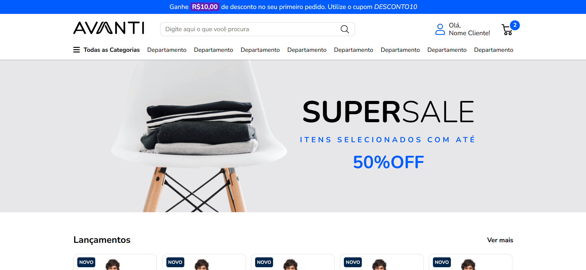

# 🛍️ Avanti Store

## 📋 Sobre o Projeto

Este projeto foi desenvolvido como resposta ao desafio técnico proposto pela [Avanti](https://penseavanti.com.br/ecommerce/lp-carreiras-innovation-class/), com o objetivo de criar o front-end de um e-commerce responsivo baseado em um design do Figma.

A implementação consiste em uma loja virtual com interface moderna e navegação intuitiva, atendendo aos requisitos definidos para avaliação de habilidades front-end.

### 🚀 Desafio Técnico
- **Prazo de Entrega:** 25/04/2025
- **Proponente:** [Avanti - Innovation Class](https://penseavanti.com.br/ecommerce/lp-carreiras-innovation-class/)
- **Objetivo:** Desenvolver um layout proposto no Figma utilizando HTML, CSS e JavaScript.

[Link para o design no Figma](https://www.figma.com/proto/DqtFxC6312M32mLt8FpJjq/innovation-class?page-id=13%3A673&node-id=13-920&viewport=346%2C140%2C0.11&t=HyGGDSs83f1vbqMJ-1&scaling=scale-down&content-scaling=fixed)

## ✨ Demonstração

### Visão Geral


### [Acesse a versão online aqui](https://willianddaniel.github.io/avanti-store-challenge/)

## 🔧 Tecnologias Utilizadas

- 
- 
- 
- 

## 🎯 Funcionalidades Implementadas

- ✅ **Layout responsivo** para desktop e dispositivos móveis
- ✅ **Carrosséis interativos** para exibição de produtos
- ✅ **Campo de busca funcional** com exibição dos termos pesquisados
- ✅ **Header com menu de navegação** e área do usuário
- ✅ **Seções de destaque** para promoções e lançamentos
- ✅ **Newsletter** para cadastro de usuários
- ✅ **Footer completo** com informações institucionais e de contato

## 📱 Responsividade

O projeto foi desenvolvido com um design responsivo, adaptando-se perfeitamente tanto para desktop quanto para dispositivos móveis, de acordo com o layout fornecido no Figma.

## 🏗️ Estrutura do Projeto

```
avanti-store/
├── assets/
│   ├── images/
│   │   ├── ...
│   │   ├── payment-methods/
│   │   │   ├── ...
│   │   └── social-media-icons/
│   │       ├── ...
├── index.html
├── style.css
├── script.js
└── README.md
```

## 📝 Detalhes da Implementação

### HTML

A estrutura HTML foi cuidadosamente organizada para refletir o layout do Figma, com foco na semântica e acessibilidade. O documento está dividido em seções claramente definidas:

- **Header**: Contém a barra de desconto, logo, campo de busca, área do usuário e menu de navegação
- **Hero Section**: Seção de destaque com promoção
- **Main**: Inclui seções de produtos em carrossel, banners informativos e formulário de newsletter
- **Footer**: Dividido em áreas para redes sociais, links institucionais, centro de ajuda, atendimento e formas de pagamento

### CSS

O CSS foi estruturado de forma modular, com estilos bem organizados para cada componente da página:

- **Reset**: Normalização dos estilos padrão do navegador
- **Layout**: Definição do grid e estrutura da página
- **Componentes**: Estilos específicos para elementos como cards, botões e formulários em css3
- **Responsividade**: Media queries para adaptação em diferentes tamanhos de tela

### JavaScript

O JavaScript implementa duas funcionalidades principais:

1. **Funcionalidade de busca**: Ao clicar no botão de lupa, exibe a mensagem "Você buscou por: [termo]"
2. **Carrosséis interativos**: Implementação dos carrosséis nas seções de produtos

## 🚀 Como Executar o Projeto

1. Clone este repositório:
```bash
git https://github.com/WillianDDaniel/avanti-store-challenge.git
```

2. Navegue até o diretório do projeto:
```bash
cd avanti-store-challenge
```

- Abra o arquivo `index.html` em seu navegador preferido.
- Ou instale a extensão [Live Server](https://marketplace.visualstudio.com/items?itemName=ritwickdey.LiveServer) em seu VSCode (Recomendado)

## 📌 Requisitos Atendidos

1. ✅ **Estruturação HTML** conforme o layout do Figma
2. ✅ **Aplicação de estilos CSS** garantindo layout responsivo para versões Desktop e Mobile
3. ✅ **Implementação da funcionalidade de busca com JavaScript**:
   - Ao clicar no botão da lupa, o texto digitado é exibido com a mensagem: "Você buscou por: 'assunto buscado'"
4. ✅ **Implementação dos carrosséis interativos**

## 👨‍💻 Autor


Desenvolvido com ❤️ por [Willian D. Daniel](https://willianddaniel.github.io/portfolio/)